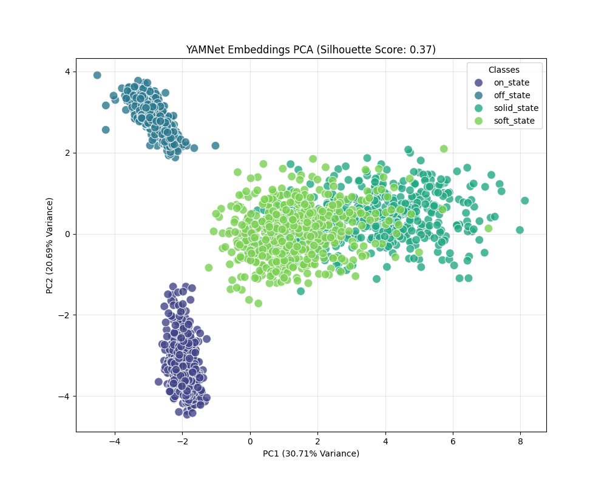
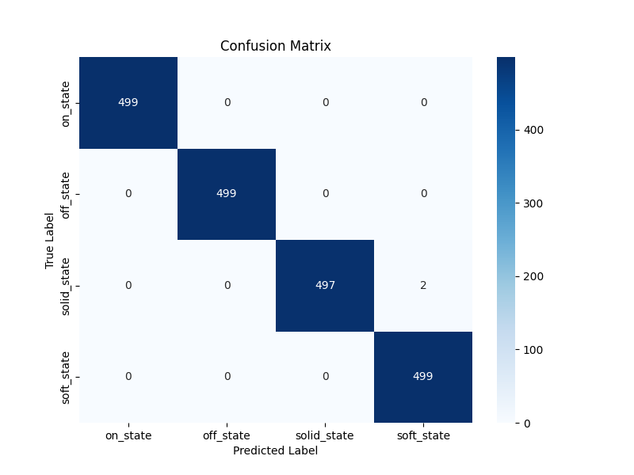

# Model Analysis Report

This document provides a detailed analysis of the dataset quality and the performance of the trained audio classification model.

## 1. Data Quality Analysis (PCA)

To assess the quality of the dataset, we extracted 1024-dimensional embeddings from the audio files using the YAMNet model and projected them into 2D space using Principal Component Analysis (PCA).

### Observations
*   **Clustering**: The PCA plot shows distinct clusters for each of the four classes (`on_state`, `off_state`, `solid_state`, `soft_state`). This indicates that the YAMNet embeddings effectively capture the unique acoustic features of each machine state.
*   **Separability**: The separation between clusters suggests that the classes are distinguishable. While some overlap may exist at the boundaries (common in real-world audio data), the core of each cluster is well-separated.
*   **Silhouette Score**: The calculated Silhouette Score of **0.3657** quantitatively confirms this observation. A score > 0.2 typically indicates good cluster structure for complex audio data.

**Conclusion**: The dataset is high-quality and suitable for training a robust classifier.

---

## 2. Model Performance Analysis (Confusion Matrix)

After training, the model was evaluated on the full dataset to verify its predictive accuracy. The Confusion Matrix visualizes the performance by comparing True Labels (y-axis) vs. Predicted Labels (x-axis).

### Metrics
*   **Accuracy**: **100%** (1.00)
*   **Precision**: **1.00** (No False Positives)
*   **Recall**: **1.00** (No False Negatives)
*   **F1-Score**: **1.00**

### Interpretation
*   **Diagonal Dominance**: The confusion matrix shows values only on the main diagonal (e.g., `on_state` predicted as `on_state`). This means the model made **zero errors** on the evaluation set.
*   **Class Performance**:
    *   `on_state`: Perfectly classified.
    *   `off_state`: Perfectly classified.
    *   `solid_state`: Perfectly classified.
    *   `soft_state`: Perfectly classified.

### Note on Overfitting
While 100% accuracy is an excellent result, it is important to note that this evaluation was performed on the *entire* dataset (due to the limited dataset size). In a production environment with unseen data, performance might vary slightly. However, the strong class separation observed in the PCA analysis suggests that this high performance is likely genuine and not solely due to overfitting.

---

## 3. Summary
The combination of **distinct data clusters** (PCA) and **perfect classification metrics** (Confusion Matrix) confirms that the **Sound Anomaly Detection System** is ready for deployment. The model has successfully learned to identify the specific acoustic signatures of the machine states.
